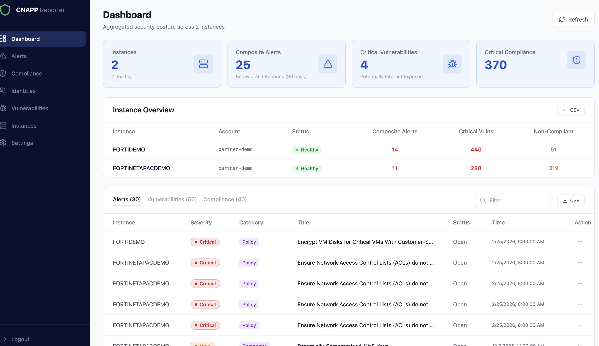
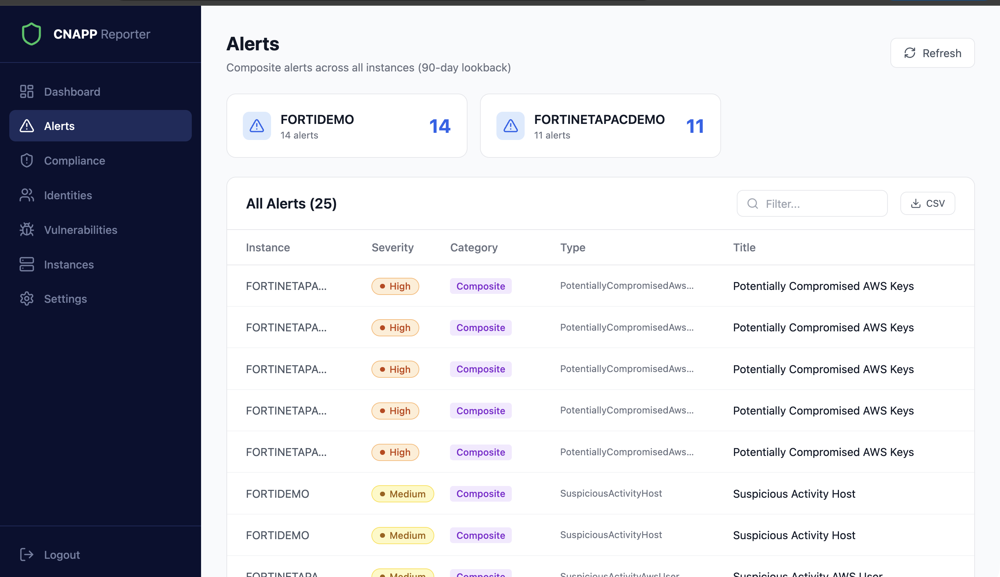
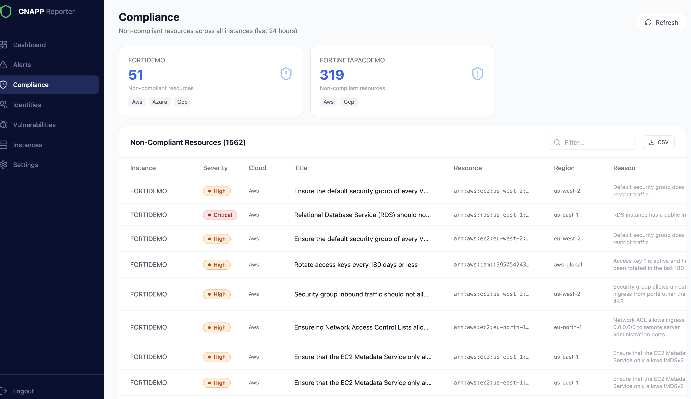
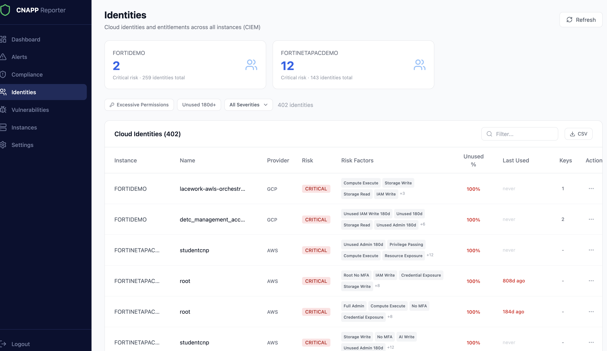
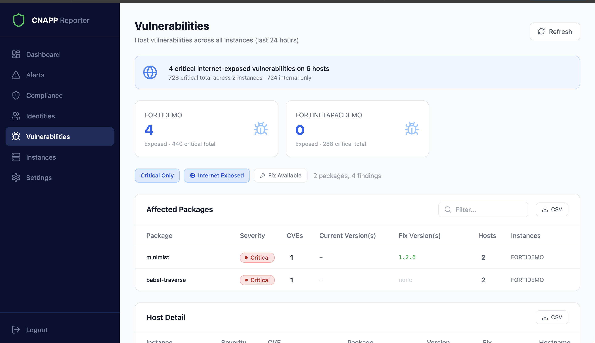

# CNAPP Reporter

Pulls together alerts, vulnerabilities, compliance issues, and identity risks from multiple FortiCNAPP (Lacework) tenants into one place. Runs as a single Docker container with a FastAPI backend, React frontend, and SQLite for local caching.



## What's in it

**Dashboard** gives you the high-level numbers across all instances (composite alerts, internet-exposed critical vulns, compliance failures) with drill-down tables you can filter by clicking an instance.

**Alerts** - composite behavioral detections (90-day lookback).

**Compliance** - non-compliant resources broken down by cloud provider.

**Identities** - CIEM view: who has excessive permissions, unused credentials, stale access keys.

**Vulnerabilities** - critical vulns with internet-exposure detection and fix availability.

Every table supports column resizing, text search, instance filtering, and CSV export.






## Tech stack

FastAPI + SQLAlchemy (async) + aiosqlite on the backend, React 18 + TypeScript + Vite + Tailwind on the frontend. Auth is JWT + bcrypt, API secrets are AES-256-GCM encrypted at rest. Ships as a multi-stage Docker build with a SQLite volume at `/app/data`.

## Getting started

### Docker

```bash
docker compose up --build
# http://localhost:8080
```

For production, set a real secret key:

```bash
SECRET_KEY=$(openssl rand -hex 32) docker compose up --build
```

### Local dev

```bash
# Backend
cd backend && pip install -r requirements.txt
uvicorn app.main:app --reload --port 8000

# Frontend (proxies /api to backend)
cd frontend && npm install && npm run dev
```

Frontend at `http://localhost:5173`, backend at `http://localhost:8000`.

### Default login

Username `admin`, password `admin123`. Change it in Settings.

## Adding instances

Go to Instances, click Add Instance. You'll need:
- The FortiCNAPP account name (e.g. `mycompany` or `mycompany.lacework.net`)
- An API key ID + secret (generate in FortiCNAPP under Settings > API Keys)
- Optionally a sub-account name

Hit Test Connection, save, then Sync to pull data.

## How it works

```
┌─────────────────────────────────────┐
│           Docker Container          │
│                                     │
│  ┌──────────┐    ┌───────────────┐  │
│  │  React   │    │   FastAPI     │  │
│  │  (static)│───▶│   /api/*     │  │
│  └──────────┘    └───────┬───────┘  │
│                          │          │
│                   ┌──────┴───────┐  │
│                   │   SQLite     │  │
│                   │  /app/data   │  │
│                   └──────────────┘  │
│                          │          │
│         ┌────────────────┼────────┐ │
│         ▼                ▼        ▼ │
│  ┌────────────┐  ┌──────────┐  ┌──┐│
│  │ Tenant A   │  │ Tenant B │  │..││
│  │ (Lacework) │  │(Lacework)│  │  ││
│  └────────────┘  └──────────┘  └──┘│
└─────────────────────────────────────┘
```

API secrets are AES-256-GCM encrypted before hitting the database. Synced data gets cached as JSON blobs per instance per data type, so the UI stays fast even if the upstream API is slow.
